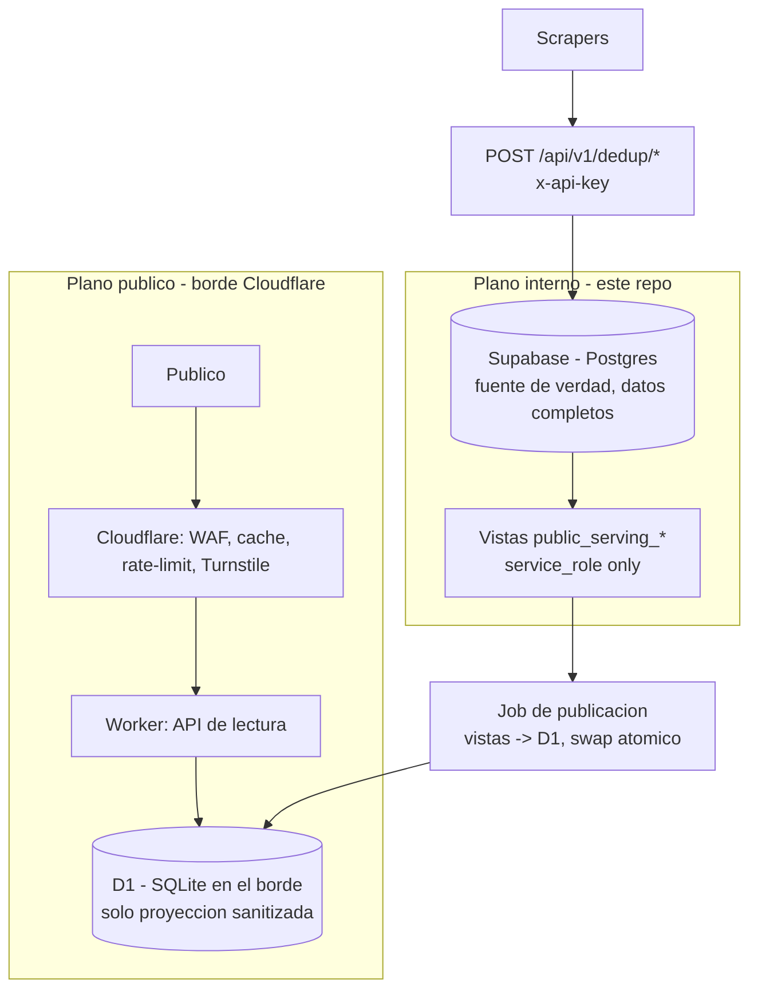

# ADR 0001 — Arquitectura del plano de serving publico

| Campo | Valor |
|---|---|
| Estado | Aceptada |
| Fecha | 2026-06-27 |
| Decisores | DB/API, Infraestructura |
| Implementado por | PR #8 (contrato + proyeccion) |
| Antecedente | VZLA_DEDUP PR #42 (ADR original) |
| Relacionado con | `docs/serving-publico.md`, `docs/openapi-public-serving.json`, `supabase/migrations/0007_public_serving_projection.sql` |

---

## 1. Contexto

`dataVenezuela` expone (o expondra) una API publica de consulta para que cualquier
persona busque registros de personas (desaparecidas, encontradas, heridas,
fallecidas), centros de acopio y eventos, consolidados desde los aportes de los
scrapers.

El contexto es una crisis (doble terremoto del 24-06-2026). Tres restricciones
dominan la decision tecnica:

1. **Costo casi nulo.** Proyecto humanitario, sin presupuesto sostenido de
   infraestructura. El plano publico debe costar ~0 en reposo.
2. **Picos de trafico extremos.** Cuando un medio comparte el enlace o hay una
   replica, llega una avalancha concentrada y muy repetitiva (los mismos nombres y
   zonas que estan en las noticias).
3. **PII como riesgo existencial.** Se trabaja con personas vulnerables. Una
   filtracion de datos en claro es inaceptable.

Este ADR formaliza la decision que ya materializo PR #8. La guia operativa vive en
`docs/serving-publico.md`; este documento es el **registro de decision canonico**:
explica el porque, las alternativas descartadas y las consecuencias.

## 2. Analisis del workload

El plano publico tiene tres propiedades:

* **Lectura-dominante, escritura por lotes.** El publico solo consulta. Los datos
  cambian por ciclos del pipeline, nunca dentro del camino de la peticion.
* **Trafico en picos y repetitivo.** Se absorbe con cache en el borde, no escalando
  una base transaccional.
* **El dato publico es un subconjunto pequeno y sanitizado** (ver vistas
  `public_serving_*`). Cabe holgadamente en un unico artefacto SQLite.

De aqui se sigue que exponer Postgres/Supabase vivo al publico es la herramienta
equivocada: paga computo 24/7, su pool de conexiones es un cuello de botella en
pico, y amplia la superficie de ataque sobre los datos completos.

## 3. Decision

Dos planos desacoplados unidos por un artefacto inmutable (patron read-model):

### 3.1 Plano interno (fuente de verdad) — este repo (Next.js + Supabase)

* Mantiene los datos completos, historial y relaciones
  (`supabase/migrations/0004_dedup_schema.sql`).
* Recibe las escrituras de los scrapers via `POST /api/v1/dedup/*` (auth
  `x-api-key`).
* RLS habilitado (`0005`) y grants por columna (`0006`) que excluyen
  `cedula_hmac` / `contact_hmac` del acceso publico.
* **Nunca debe recibir trafico del publico de consulta.**

### 3.2 Plano publico (serving) — Cloudflare Worker + D1

* API de **solo lectura** servida desde el borde.
* Los datos viven en **D1** (SQLite en el borde) con **solo la proyeccion
  sanitizada**: las vistas `public_serving_*`.
* `cedula_hmac` se conserva en el artefacto **solo como llave interna de lookup**;
  no forma parte de ninguna respuesta HTTP.
* El borde aporta **cache, WAF, rate-limit y Turnstile**, que absorben los picos.

### 3.3 Puente — job de publicacion (cron)

* Un job lee las vistas `public_serving_*` con `service_role` y publica un
  artefacto D1 con **swap atomico**, cada ciclo (alineado a la frecuencia del
  pipeline).

### 3.4 Estado de implementacion

| Pieza | Estado | Donde |
|---|---|---|
| Proyeccion sanitizada | Hecho (PR #8) | `supabase/migrations/0007_public_serving_projection.sql` |
| Contrato HTTP | Hecho (PR #8) | `docs/openapi-public-serving.json` |
| Test de no-PII + anti-abuso | Hecho (PR #8) | `src/lib/public-serving/__tests__/openapi-contract.test.ts` |
| Job de publicacion a D1 | Pendiente | ver `docs/serving-implementation-plan.md` |
| Worker | Pendiente | idem |
| Config de borde (cache/WAF/rate-limit/Turnstile) | Pendiente | idem |
| Derecho al olvido (denylist) | Pendiente | idem |

## 4. Diagrama



## 5. Modelo de datos del artefacto publico

El artefacto D1 se materializa desde las vistas `public_serving_*`. Para personas
(de `public_serving_persons`):

```text
person_record_id, event_id, full_name, alternate_names,
cedula_hmac        -- solo lookup interno, NUNCA en respuesta HTTP
cedula_masked, age_range, sex, last_known_location,
status, verification_status, confidence_score, source_url
```

La respuesta HTTP (`PersonPublic` en el OpenAPI) excluye `cedula_hmac`.

**Prohibido en el plano publico:** cedula/telefono en claro, `contact_hmac`,
`raw_json`, `raw_text`, `scraper_id`, `partner_api_keys`, fotos reales y datos
medicos identificables. El test de contrato lo verifica de forma automatica.

> Garantia de blast-radius: una brecha total del plano publico expone, en el peor
> caso, datos ya sanitizados. El plano interno y los crudos quedan intactos.

## 6. Contrato de la API publica (v1)

Solo lectura. Definido en `docs/openapi-public-serving.json`.

```text
GET /healthz                                  -> { ok, snapshot_version? }
GET /v1/personas?nombre=&estado=&status=&limit=
GET /v1/personas/{person_record_id}
GET /v1/acopio?estado=&needs=&status=&limit=
GET /v1/events?status=&limit=
```

Reglas anti-abuso (en el contrato y verificadas por test):

* `nombre` **requerido**, min 3 / max 120 caracteres (anti-enumeracion).
* `limit` **maximo 20** en todos los listados (sin volcado masivo).
* Sin endpoint de "listar todo" ni paginacion profunda.

## 7. Actualizacion y derecho al olvido

El job de publicacion reemplaza el artefacto D1 con **swap atomico**: ninguna
peticion observa estado parcial. Una peticion de borrado entra como **denylist**
aplicada por el job; se propaga al plano publico en <=1 ciclo, sin tocar el
historial del plano interno.

## 8. Consecuencias

**Positivas**

* Costo ~0 en reposo y plano frente a picos.
* Latencia baja para usuarios en Venezuela (servido desde el borde).
* Blast-radius de PII acotado a datos ya sanitizados.
* Pipeline y plano publico desacoplados: un fallo de ingesta no tumba la busqueda.

**Negativas / costos asumidos**

* El Worker se implementa en TypeScript fuera del flujo Next.js (proyecto Cloudflare
  aparte). El resto del repo sigue en su stack actual.
* El rebuild de D1 exige cuidado operativo (swap atomico).
* Datos publicos *eventualmente consistentes* (retraso de hasta un ciclo). Aceptable
  para este dominio.

## 9. Alternativas consideradas

**A. Exponer Postgres/Supabase directo al publico.** Rechazada: costo 24/7, pool de
conexiones como cuello de botella en pico, mayor superficie sobre datos completos.

**B. FastAPI + SQLite-en-memoria sobre un origen (Cloud Run/Fly), artefacto en R2.**
Viable; es el camino de respaldo si D1 queda chico. El contrato HTTP (seccion 6) es
identico, asi que migrar cuesta poco. Se descarto como opcion principal por anadir un
origen que mantener, cold starts y latencia de una sola region.

**C. Cloudflare Worker + D1 (elegida).** Costo cero real, sin origen que mantener,
ejecucion en el borde cerca del usuario.

## 10. Conciliacion de contrato (deltas a registrar)

* **`is_minor`**: la vista `public_serving_persons` (0007) lo omite; el ADR original
  de VZLA_DEDUP lo incluia. Decision pendiente del equipo: excluir a proposito (mayor
  proteccion de menores) o incluir. Si se incluye, es una tarea de schema, no se
  cambia aqui.
* **Detalle de persona**: `/v1/personas/{id}` no trae `notes`/`sources`/`photos` (no
  hay vistas de proyeccion para esas tablas). v1 = detalle minimo; el detalle
  enriquecido se difiere a v1.1.
* **Enums cross-repo**: los scrapers de VZLA_DEDUP emiten estados en espanol
  (`desaparecido/encontrado/fallecido`), pero la ingesta exige ingles
  (`missing/found/...`, ver `src/lib/dedup/validation.ts`). El pipeline debe mapear
  ES->EN antes de hacer POST. Follow-up cross-repo.

## 11. Notas de privacidad relacionadas

Dos exposiciones del plano interno contradicen el principio "cero PII en claro en el
plano publico" y se revisan en `docs/serving-pii-review.md`:

* `GET /api/aportes` sirve `raw_json`/`raw_text` al publico (puede contener PII en
  claro).
* `person_notes` (campos hospitalarios/medicos) tiene grant a `anon` via Data API.

---

## Regla de oro

```text
Duplicar es tolerable.
Perder trazabilidad no.
Exponer PII no.
El plano publico no posee datos en claro.
```
